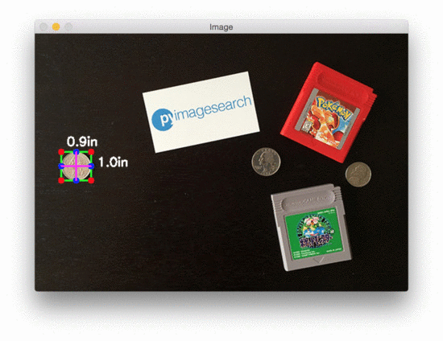

# 🎉 CV Size Detection

Welcome to the **cv-size-detection** GitHub repository! 🚀 This project transforms your webcam into a measuring device using the power of computer vision. With the help of OpenCV and Aruco markers, you can detect objects and measure their dimensions directly from your camera feed in real-time. It's like having a digital ruler, but way cooler! 😎



## Table of Contents

- [What’s This About?](#whats-this-about)
- [Get Set Up](#get-set-up)
- [How to Play](#how-to-play)
- [Repo Rundown](#repo-rundown)

## What’s This About? 🧐

Imagine being able to measure objects just by pointing your webcam at them. That's exactly what this project does! By placing an Aruco marker (think of it like a special QR code) in the camera’s view, our script can detect objects and report their exact size in inches. All of this happens in real-time, so you can wave your objects around and watch the measurements update live!

## Get Set Up 🛠️

### Prerequisites

To get started, you'll need:
- Python 3.x
- OpenCV
- NumPy 
- imutils
- scipy

### Install the Goodies

1. First, clone this repo:
    ```bash
    git clone https://github.com/shaileshsaravanan/cv-size-detection.git
    cd cv-size-detection
    ```

2. Then, install the required Python packages:
    ```bash
    pip install -r requirements.txt
    ```

## How to Play 🎮

### Fire Up the Object Size Detector

Once you're all set up, it’s time to launch the magic:

```bash
python main/final.py
```

**Note:** Make sure your webcam is plugged in and ready to go. By default, the script looks for it on input "0" (`cv2.VideoCapture(0)`).

### Watch the Magic Happen ✨

- As the script runs, you'll see your webcam feed, and anything the script detects will get a green rectangle around it.
- The dimensions of the object (in inches) will pop up next to it like a video game HUD! 
- Remember, the Aruco marker is essential—it needs to be in the frame for the measurements to work their magic. 

## Repo Rundown 🗂️

Here’s a quick tour of what you’ll find in this repository:

- **main/**: The brain of the operation.
  - `final.py`: The main script that captures the video, detects objects, and calculates their sizes.
  - `object_detector.py`: This script handles object detection functionality, which can be integrated into the main script.

- **train + test/**: Contains datasets and results for training and testing that helped achieve the current model iteration!
